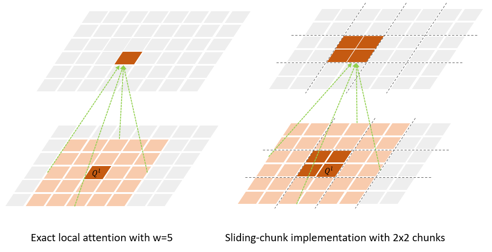
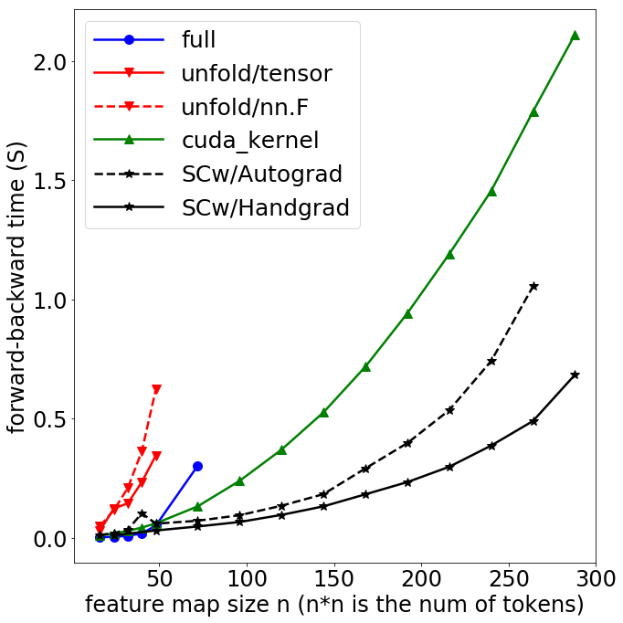
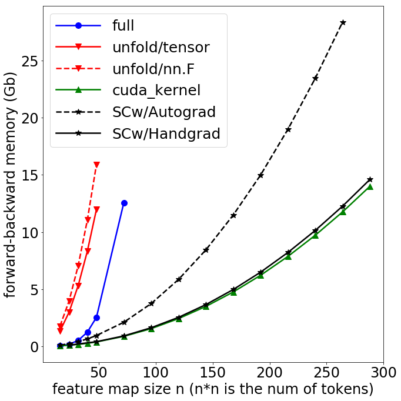
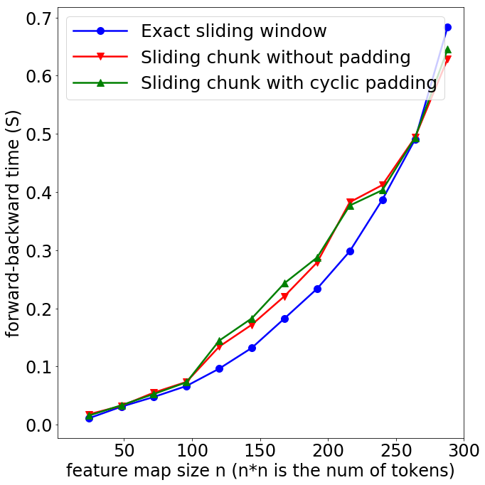
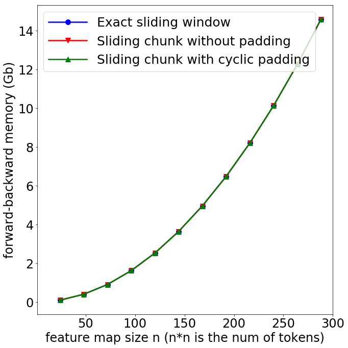
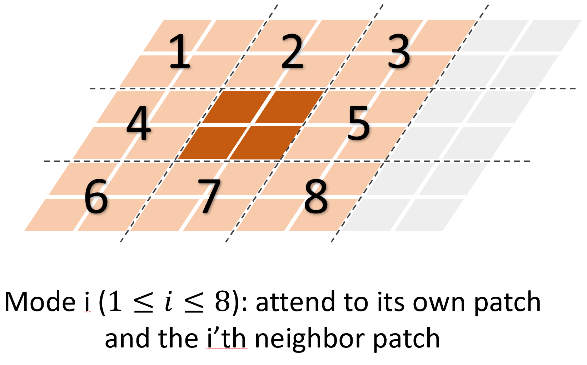

# Implementation Details of Conv-like Local Attention in Vision Longformer

## Illustration of "exact sliding window" and "sliding chunk"

 

## Three implementations

There is a trivial implementation of the conv-like sliding window attention, in which we compute the full quadratic attention and then mask out non-neighbor tokens. This approach suffers from the quadratic complexity w.r.t. number of tokens (quartic w.r.t. feature map size), and is impractical for real use, as shown by the blue curve in figures below. We only use it to verify the correctness of our other implementations. 

Other than the trivial implementation, we implemented Vision Longformer in three ways, and benchmarked their speed and memory usage with [script](src/tests/benchmark_vil.py). The results are shown in figures below.

- Using Pytorch's unfold function. We have two sub-versions: one using nn.functional.unfold (denoted as `unfold/nn.F`) and the other using tensor.unfold (denoted as `unfold/tensor`). We tested its correctness with [script](src/tests/test_unfoldattn.py). As shown in figures below, the `unfold/tensor` version (red solid line) is more efficient both in time and memory than the `unfold/nn.F` version (red dotted line). However, both of them are even slower and use more memory than the full attention!
- Using a customized CUDA kernel, denoted as `cuda_kernel`. We make use of the TVM, like what has done in [Longformer](https://github.com/allenai/longformer), to write a customized CUDA kernel for vision longformer. We tested its correctness with [script](src/tests/test_cuda_kernel.py). As shown in figures below, the `cuda_kernel` (green line) achieves the theoretical optimal memory usage. Its time complexity is also reduced to linear w.r.t. number of tokens (quadratic w.r.t. feature map size). However, since it's not making use of the highly optimized matrix multiplication libraries in CUDA, it's speed is still slow in practice.
- Using a sliding chunk approach, illustrated in figure above (Right). For this sliding chunk approach, we have two subversions: one using Pytorch's autograd to compute backward step (denoted as `SCw/Autograd`) and the other writing a [customized torch.autograd.Function](src/models/layers/slidingchunk_2d.py) with hand-written backward function (denoted as `SCw/Handgrad`). Both sub versions of this sliding chunk approach are fully implemented with Pytorch functions and thus make use of highly optimized matrix multiplication libraries in CUDA. We tested its correctness with [script](src/tests/test_slidingchunk_2d.py). As shown in figures blow, both of them are faster than the `cuda_kernel` implementation.

Speed (forward and backward)             |  Memory Usage
:-------------------------:|:-------------------------:
 | 

In the sliding chunk approach, to achieve a conv-like local attention mechanism with window size $2 w + 1$, we split the feature map into chunks with size $w \times w$. Each chunk only attends to itself and its 8 neighbor chunks. The Pytorch Autograd will save 9 copies of the feature map (9 nodes in the computing graph) for automatic back-propagation, which is not time/memory efficient. The `SCw/Handgrad` version defines [a customized torch.autograd.Function](src/models/layers/slidingchunk_2d.py) with hand-written backward function, which greatly saves the memory usage and also speeds up the algorithm, as shown in figures above. We would like to point out that the memory usage of the `SCw/Handgrad` version is nearly optimal (very close to that of the `cuda_kernel`).

## Three masking methods for the "sliding chunk" implementation

This sliding-chunk implementation lets one token attends to more tokens than the exact conv-like local attention. Our sliding-chunk implementation has the choice to be 
```
# Three masking methods of longformer attention with sliding chunk implementation:
# 1: exact conv-like local attention
# 0: blockwise sliding chunk without padding
# -1: blockwise sliding chunk with cyclic padding
_C.MODEL.VIT.MSVIT.SW_EXACT = 0
```
Since these three masking methods only differ by the attention masks to mask out invalid tokens, their speed and memory usage are nearly the same, as shown in figures below. By default, we use `sliding chunk without padding` (`MODEL.VIT.MSVIT.SW_EXACT = 0`). 

Speed (forward and backward)             |  Memory Usage
:-------------------------:|:-------------------------:
 | 


## Random-shifting strategy during training


We propose the random-shifting training strategy for vision longformer, to further accelerate the training speed of vision longformer.

More specifically, instead of attending to all 8 neighbor patches, one patch can only attend to itself and one random neighbor patch during training. 
To achieve this, we define [10 modes of the conv-like local attention](src/models/layers/slidingchunk_2d.py):
```
0 (default) : attend to itself and all 8 neighbor patches,
-1 : only attend to itself patch,
i (1 <= i <=8) : attend to itself patch and the i'th neighbor patch,
```
The ordering of the 8 neighbor patches is visualized in the figure above.
During training, we can randomly sample one mode from 1 to 8 and perform the corresponding random-shifting attention. 
This behavior is controlled by the following switch in the config:
```a
# 0: all 8 neighbor blocks; -1: no neighbor block; >0: random sample one block
_C.MODEL.VIT.MSVIT.MODE = 0
# Switching time from mode 1 to mode 0 during training
_C.MODEL.VIT.MSVIT.VIL_MODE_SWITCH = 0.75
```
We also allow to switch from the random-shifting attention mode to the default 8-neighbor attention mode after `75%` training iterations. 
This switching time `75%` is controlled by the parameter `_C.MODEL.VIT.MSVIT.VIL_MODE_SWITCH `. 
This random-shifting training strategy accelerate the vision-longformer training significantly. 

## Try the customized CUDA kernel

First, download the [customized CUDA kernel files](https://penzhanwu2.blob.core.windows.net/imagenet/msvit/visionlongformer/deepbase_18241_lr8e-4/), extract the files and put them in the corresponding places in the code folder.

You can test the correctness of your installation with this [script](src/tests/test_cuda_kernel.py).

Use the choice `MODEL.VIT.MSVIT.ATTN_TYPE = longformer_cuda` to run the vision longformer with this customized cuda kernel.

### Environment requirements 
For virtual environment user, one need the following setup inside the environment:
```
conda install cudatoolkit=10.0
python -m pip install CausalDomainTransfer/src # to prepare the tvm package
```
For Docker user, one can use the following docker.
```
pengchuanzhang/maskrcnn:py3.7-cuda10.0-pytorch1.7
```
You may need to reset the environment variable 
```
export MKL_THREADING_LAYER='GNU'
```
due to a known [pytorch-mkl issue](https://github.com/pytorch/pytorch/issues/37377)
