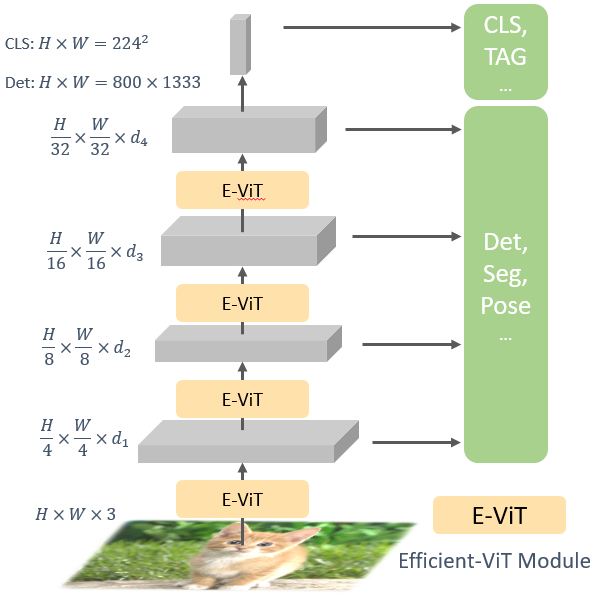
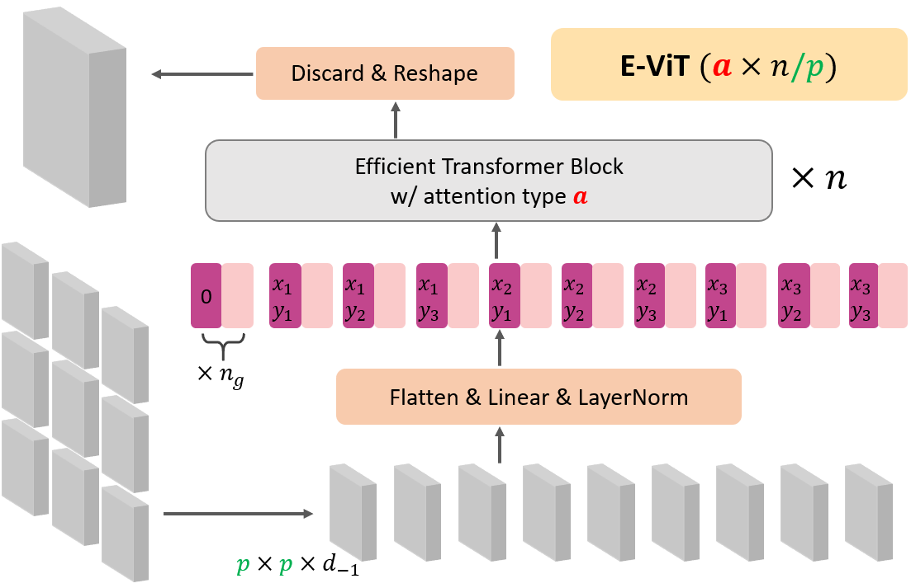

# Vision Longformer
 
This project provides the source code for the vision longformer paper.

[Multi-Scale Vision Longformer: A New Vision Transformer for High-Resolution Image Encoding](https://arxiv.org/abs/2103.15358)

## Highlights
- **Fast Pytorch implementation of conv-like sliding-window local attention**
- **Fast random-shifting training strategy of vision longformer**
- **A versatile multi-scale vision transformer class (MsViT) that can support various efficient attention mechanisms**
- **Compare multiple efficient attention mechanisms:** vision-longformer ("global + conv_like local") attention, [performer attention](https://arxiv.org/abs/2009.14794), global-memory attention, [linformer attention](https://arxiv.org/abs/2006.04768) and [spatial reduction attention](https://arxiv.org/abs/2102.12122).
- Provides pre-trained models for different attention mechanisms. 


## Updates
- 03/29/2021: First version of [vision longformer paper](https://arxiv.org/abs/2103.15358) posted on Arxiv.  <br/>
- 04/30/2021: Performance improved by adding relative positional bias, inspired by [Swin Transformer](https://github.com/microsoft/Swin-Transformer)! Training is accelerated significantly by adding random-shifting training strategy. First version of code released. 


## Multi-scale Vision Transformer Architecture 
 

Vision Longformer, and more generally the Multi-scale Vision Transformer (MsViT), follows the multi-stage design of ResNet. Each stage is a (slightly modified) vision transformer with some user-specified attenion mechanism. Currently, five attention mechanisms are supported:

```
# choices=['full', 'longformerhand', 'linformer', 'srformer', 'performer', 'longformerauto', 'longformer_cuda']
_C.MODEL.VIT.MSVIT.ATTN_TYPE = 'longformerhand'
```

 

As an example, a 3-stage multi-scale model architecture is specified by the `MODEL.VIT.MSVIT.ARCH`:
```
_C.MODEL.VIT.MSVIT.ARCH = 'l1,h3,d192,n1,s1,g1,p16,f7,a1_l2,h6,d384,n10,s0,g1,p2,f7,a1_l3,h12,d796,n1,s0,g1,p2,f7,a1'
```

Configs of different stages are separated by `_`. For each stage, the meaning of the config `l*,h*,d*,n*,s*,g*,p*,f*,a*` is specified as below.

symbol    | l | h | d | n | s  | g  |  p  |  f  | a |
--------|-----|-----|-----|-----|-----|-----|------|------|--------|
Name	| stage | num_heads | hidden_dim | num_layers | is_parse_attention |  num_global_tokens  |  patch_size   |   num_feats  |    absolute_position_embedding   |
Range  | [1,2,3,4] | N+ | N+ | N+ | [0, 1] | N | N | N |   [0,1] |

Here, `N` stands for natural numbers including 0, and `N+` stands for positive integers.

The `num_feats` (number of features) field, i.e., `f`, is overloaded for different attention mechanisms:
```
linformer: number of features

performer: number of (random orthogonal) features

srformer: spatial reduction ratio

longformer: one sided window size (not including itself, actual window size is 2 * f + 1 for MSVIT.SW_EXACT = 1 and 3 * f for MSVIT.SW_EXACT = 0/-1).
```

The following are the main model architectures used in [Vision Longformer paper](https://arxiv.org/abs/2103.15358).

Model size    | stage_1 | stage_2 | stage_3 | stage_4 |
--------|-----|-----|-----|-----|
Tiny	| n1,p4,h1,d48 | n1,p2,h3,d96 | n9,p2,h3,d192 | n1,p2,h6,d384 |
Small  | n1,p4,h3,d96 | n2,p2,h3,d192 | n8,p2,h6,d384 | n1,p2,h12,d768 |
Medium-Deep  | n1,p4,h3,d96 | n4,p2,h3,d192 | n16,p2,h6,d384 | n1,p2,h12,d768 |
Medium-Wide  | n1,p4,h3,d192 | n2,p2,h6,d384 | n8,p2,h8,d512 | n1,p2,h12,d768 |
Base-Deep  | n1,p4,h3,d96 | n8,p2,h3,d192 | n24,p2,h6,d384 | n1,p2,h12,d768 |
Base-Wide  | n1,p4,h3,d192 | n2,p2,h6,d384 | n8,p2,h12,d768 | n1,p2,h16,d1024 |

## Model Performance
### Main Results on ImageNet and Pretrained Models

**Vision Longformer with absolute positional embedding**

| name | pretrain | resolution |acc@1 | acc@5 | #params | FLOPs | 22K model | 1K model |
| :---: | :---: | :---: | :---: | :---: | :---: | :---: | :---: |:---: |
| ViL-Tiny | ImageNet-1K | 224x224 | 76.3 | 93.3 | 6.7M | 1.43G | - | [ckpt](https://penzhanwu2.blob.core.windows.net/imagenet/msvit/visionlongformer/msvit_tiny_longformersw_1191_train/model_best.pth), [config](https://penzhanwu2.blob.core.windows.net/imagenet/msvit/visionlongformer/msvit_tiny_longformersw_1191_train/config.yaml) |
| ViL-Small | ImageNet-1K | 224x224 | 82.0 | 95.8 | 24.6M | 5.12G | - | [ckpt](https://penzhanwu2.blob.core.windows.net/imagenet/msvit/visionlongformer/msvit_small_longformersw_1281_train/model_best.pth), [config](https://penzhanwu2.blob.core.windows.net/imagenet/msvit/visionlongformer/msvit_small_longformersw_1281_train/config.yaml) |
| ViL-Medium-Deep | ImageNet-1K | 224x224 | 83.3 | 96.3 | 39.7M | 9.1G | - | [ckpt](https://penzhanwu2.blob.core.windows.net/imagenet/msvit/visionlongformer/deepmedium_14161_lr8e-4/model_best.pth), [config](https://penzhanwu2.blob.core.windows.net/imagenet/msvit/visionlongformer/deepmedium_14161_lr8e-4/config.yaml) |
| ViL-Medium-Wide | ImageNet-1K | 224x224 | 82.9 | 96.4 | 39.8M | 11.3G | - | [ckpt](https://penzhanwu2.blob.core.windows.net/imagenet/msvit/visionlongformer/wide_medium_1281/model_best.pth), [config](https://penzhanwu2.blob.core.windows.net/imagenet/msvit/visionlongformer/wide_medium_1281/config.yaml) |
| ViL-Medium-Deep | ImageNet-22K | 384x384 | 85.6 | 97.7 | 39.7M | 29.4G | [ckpt](https://penzhanwu2.blob.core.windows.net/imagenet/msvit/IN22kpretrained/deepmedium/model_best.pth), [config](https://penzhanwu2.blob.core.windows.net/imagenet/msvit/IN22kpretrained/deepmedium/config.yaml) | [ckpt](https://penzhanwu2.blob.core.windows.net/imagenet/msvit/IN384_IN22kpretrained/msvitdeepmedium_imagenet384_finetune_bsz256_lr001_wd0/model_best.pth), [config](https://penzhanwu2.blob.core.windows.net/imagenet/msvit/IN384_IN22kpretrained/msvitdeepmedium_imagenet384_finetune_bsz256_lr001_wd0/config.yaml) |
| ViL-Medium-Wide | ImageNet-22K | 384x384 | 84.7 | 97.3 | 39.8M | 35.1G | [ckpt](https://penzhanwu2.blob.core.windows.net/imagenet/msvit/IN22kpretrained/widemedium/model_best.pth), [config](https://penzhanwu2.blob.core.windows.net/imagenet/msvit/IN22kpretrained/widemedium/config.yaml) | [ckpt](https://penzhanwu2.blob.core.windows.net/imagenet/msvit/IN384_IN22kpretrained/msvitwidemedium_imagenet384_finetune_bsz512_lr004_wd0/model_best.pth), [config](https://penzhanwu2.blob.core.windows.net/imagenet/msvit/IN384_IN22kpretrained/msvitwidemedium_imagenet384_finetune_bsz512_lr004_wd0/config.yaml) |
| ViL-Base-Deep | ImageNet-22K | 384x384 | 86.0 | 97.9 | 55.7M | 45.3G | [ckpt](https://penzhanwu2.blob.core.windows.net/imagenet/msvit/IN22kpretrained/deepbase/model_best.pth), [config](https://penzhanwu2.blob.core.windows.net/imagenet/msvit/IN22kpretrained/deepbase/config.yaml) | [ckpt](https://penzhanwu2.blob.core.windows.net/imagenet/msvit/IN384_IN22kpretrained/msvitdeepbase_imagenet384_finetune_bsz640_lr003_wd0/model_best.pth), [config](https://penzhanwu2.blob.core.windows.net/imagenet/msvit/IN384_IN22kpretrained/msvitdeepbase_imagenet384_finetune_bsz640_lr003_wd0/config.yaml) |
| ViL-Base-Wide | ImageNet-22K | 384x384 | 86.2 | 98.0 | 79.0M | 55.8G | [ckpt](https://penzhanwu2.blob.core.windows.net/imagenet/msvit/IN22kpretrained/widebase/model_best.pth), [config](https://penzhanwu2.blob.core.windows.net/imagenet/msvit/IN22kpretrained/widebase/config.yaml) | [ckpt](https://penzhanwu2.blob.core.windows.net/imagenet/msvit/IN384_IN22kpretrained/msvitwidebase_imagenet384_finetune_bsz768_lr001_wd1e-7/model_best.pth), [config](https://penzhanwu2.blob.core.windows.net/imagenet/msvit/IN384_IN22kpretrained/msvitwidebase_imagenet384_finetune_bsz768_lr001_wd1e-7/config.yaml) |


**Vision Longformer with *relative positional embedding* and comparison with [Swin Transformers](https://github.com/microsoft/Swin-Transformer)**

| name | pretrain | resolution |acc@1 | acc@5 | #params | FLOPs | 22K model | 1K model |
| :---: | :---: | :---: | :---: | :---: | :---: | :---: | :---: |:---: |
| ViL-Tiny | ImageNet-1K | 224x224 | 76.65 | 93.55 | 6.7M | 1.43G | - | [ckpt](https://penzhanwu2.blob.core.windows.net/imagenet/msvit/visionlongformer/longtiny1191_ape0_exact0_nglo1_mode1_swith075/model_best.pth) [config](https://penzhanwu2.blob.core.windows.net/imagenet/msvit/visionlongformer/longtiny1191_ape0_exact0_nglo1_mode1_swith075/config.yaml) |
| ViL-Small | ImageNet-1K | 224x224 | 82.39 | 95.92 | 24.6M | 5.12G | - | [ckpt](https://penzhanwu2.blob.core.windows.net/imagenet/msvit/visionlongformer/small1281_relative/model_best.pth) [config](https://penzhanwu2.blob.core.windows.net/imagenet/msvit/visionlongformer/small1281_relative/config.yaml) |
| ViL-Medium-Deep | ImageNet-1K | 224x224 | 83.52 | 96.52 | 39.7M | 9.1G | - | [ckpt](https://penzhanwu2.blob.core.windows.net/imagenet/msvit/visionlongformer/longdeepmedium_ape0_exact0_mode1_switch075/model_best.pth) [config](https://penzhanwu2.blob.core.windows.net/imagenet/msvit/visionlongformer/longdeepmedium_ape0_exact0_mode1_switch075/config.yaml) | 
| ViL-Medium-Deep | ImageNet-22K | 384x384 | 85.73 | 97.8 | 39.7M | 29.4G | [ckpt](https://penzhanwu2.blob.core.windows.net/imagenet/msvit/IN22kpretrained/deepmedium_relative/model_best.pth) [config](https://penzhanwu2.blob.core.windows.net/imagenet/msvit/IN22kpretrained/deepmedium_relative/config.yaml) | [ckpt](https://penzhanwu2.blob.core.windows.net/imagenet/msvit/IN384_IN22kpretrained/msvitdeepmedium_imagenet384_finetune_bsz256_lr001_wd1e-7_ape0/model_best.pth) [config](https://penzhanwu2.blob.core.windows.net/imagenet/msvit/IN384_IN22kpretrained/msvitdeepmedium_imagenet384_finetune_bsz256_lr001_wd1e-7_ape0/config.yaml) |
| ViL-Base-Deep | ImageNet-22K | 384x384 | 86.11 | 97.89 | 55.7M | 45.3G | [ckpt](https://penzhanwu2.blob.core.windows.net/imagenet/msvit/IN22kpretrained/deepbase_relative/model_best.pth) [config](https://penzhanwu2.blob.core.windows.net/imagenet/msvit/IN22kpretrained/deepbase_relative/config.yaml) | [ckpt](https://penzhanwu2.blob.core.windows.net/imagenet/msvit/IN384_IN22kpretrained/msvitdeepbase_imagenet384_finetune_bsz320_lr0015_wd0_ape0/model_best.pth) [config](https://penzhanwu2.blob.core.windows.net/imagenet/msvit/IN384_IN22kpretrained/msvitdeepbase_imagenet384_finetune_bsz320_lr0015_wd0_ape0/config.yaml) |
| --- | --- | --- | --- | --- | --- | --- | --- |--- |
| [Swin-Tiny (2-2-6-2)](https://github.com/microsoft/Swin-Transformer) | ImageNet-1K | 224x224 | 81.2 | 95.5 | 28M | 4.5G | - | from [swin repo](https://github.com/microsoft/Swin-Transformer) |
| ViL-Swin-Tiny (2-2-6-2) | ImageNet-1K | 224x224 | 82.71 | 95.95 | 28M | 5.33G | - | [ckpt](https://penzhanwu2.blob.core.windows.net/imagenet/msvit/visionlongformer/swintiny_ape0_exact0_nglo1/model_best.pth) [config](https://penzhanwu2.blob.core.windows.net/imagenet/msvit/visionlongformer/swintiny_ape0_exact0_nglo1/config.yaml) |
| [Swin-Small (2-2-18-2)](https://github.com/microsoft/Swin-Transformer) | ImageNet-1K | 224x224 | 83.2	| 96.2 | 50M | 8.7G | - | from [swin repo](https://github.com/microsoft/Swin-Transformer) |
| ViL-Swin-Small (2-2-18-2) | ImageNet-1K | 224x224 | 83.7 | 96.43 | 50M | 9.85G | - | [ckpt](https://penzhanwu2.blob.core.windows.net/imagenet/msvit/visionlongformer/fromswinsmall_mode1_switch0875/model_best.pth) [config](https://penzhanwu2.blob.core.windows.net/imagenet/msvit/visionlongformer/fromswinsmall_mode1_switch0875/config.yaml) |


**Results of other attention mechanims (Small size)**

| Attention | pretrain | resolution |acc@1 | acc@5 | #params | FLOPs | 22K model | 1K model |
| :---: | :---: | :---: | :---: | :---: | :---: | :---: | :---: |:---: |
| full | ImageNet-1K | 224x224 | 81.9 | 95.8 | 24.6M | 6.95G | - | [ckpt](https://penzhanwu2.blob.core.windows.net/imagenet/msvit/fullMSA/small1281/model_best.pth), [config](https://penzhanwu2.blob.core.windows.net/imagenet/msvit/fullMSA/small1281/config.yaml) |
| longformer | ImageNet-1K | 224x224 | 82.0 | 95.8 | 24.6M | 5.12G | - | [ckpt](https://penzhanwu2.blob.core.windows.net/imagenet/msvit/visionlongformer/msvit_small_longformersw_1281_train/model_best.pth), [config](https://penzhanwu2.blob.core.windows.net/imagenet/msvit/visionlongformer/msvit_small_longformersw_1281_train/config.yaml) |
| --- | --- | --- | --- | --- | --- | --- | --- |--- |
| linformer | ImageNet-1K | 224x224 | 81.0 | 95.4 | 26.3M | 5.62G | - | [ckpt](https://penzhanwu2.blob.core.windows.net/imagenet/msvit/linformer/small1281_full/model_best.pth), [config](https://penzhanwu2.blob.core.windows.net/imagenet/msvit/linformer/small1281_full/config.yaml) |
| srformer/64 | ImageNet-1K | 224x224 | 76.4 | 92.9 | 52.9M | 3.97G | - | [ckpt](https://penzhanwu2.blob.core.windows.net/imagenet/msvit/srformer/srformerfull1281/model_best.pth), [config](https://penzhanwu2.blob.core.windows.net/imagenet/msvit/srformer/srformerfull1281/config.yaml) |
| srformer/32 | ImageNet-1K | 224x224 | 79.9 | 94.9 | 31.1M | 4.28G | - | [ckpt](https://penzhanwu2.blob.core.windows.net/imagenet/msvit/srformer/srformerfull8_1281/model_best.pth), [config](https://penzhanwu2.blob.core.windows.net/imagenet/msvit/srformer/srformerfull8_1281/config.yaml) |
| global | ImageNet-1K | 224x224 | 79.0 | 94.5 | 24.9M | 6.78G | - | [ckpt](https://penzhanwu2.blob.core.windows.net/imagenet/msvit/globalformer/globalfull1281/model_best.pth), [config](https://penzhanwu2.blob.core.windows.net/imagenet/msvit/globalformer/globalfull1281/config.yaml) |
| performer | ImageNet-1K | 224x224 | 78.7 | 94.3 | 24.8M | 6.26G | - | [ckpt](https://penzhanwu2.blob.core.windows.net/imagenet/msvit/performer/partialperformer1281/model_best.pth), [config](https://penzhanwu2.blob.core.windows.net/imagenet/msvit/performer/partialperformer1281/config.yaml) |
| --- | --- | --- | --- | --- | --- | --- | --- |--- |
| partial linformer | ImageNet-1K | 224x224 | 81.8 | 95.9 | 25.8M | 5.21G | - | [ckpt](https://penzhanwu2.blob.core.windows.net/imagenet/msvit/linformer/small1281_partial/model_best.pth), [config](https://penzhanwu2.blob.core.windows.net/imagenet/msvit/linformer/small1281_partial/config.yaml) |
| partial srformer/32 | ImageNet-1K | 224x224 | 81.6 | 95.7 | 26.4M | 4.57G | - | [ckpt](https://penzhanwu2.blob.core.windows.net/imagenet/msvit/srformer/srformerpartial1281/model_best.pth), [config](https://penzhanwu2.blob.core.windows.net/imagenet/msvit/srformer/srformerpartial1281/config.yaml) |
| partial global | ImageNet-1K | 224x224 | 81.4 | 95.7 | 24.9M | 6.3G | - | [ckpt](https://penzhanwu2.blob.core.windows.net/imagenet/msvit/globalformer/globalpartial1281/model_best.pth), [config](https://penzhanwu2.blob.core.windows.net/imagenet/msvit/globalformer/globalpartial1281/config.yaml) |
| partial performer | ImageNet-1K | 224x224 | 81.7 | 95.7 | 24.7M | 5.52G | - | [ckpt](https://penzhanwu2.blob.core.windows.net/imagenet/msvit/performer/partialperformer1281/model_best.pth), [config](https://penzhanwu2.blob.core.windows.net/imagenet/msvit/performer/partialperformer1281/config.yaml) |

See more results on comparing different efficient attention mechanisms in Table 13 and Table 14 in the [Vision Longformer paper](https://arxiv.org/abs/2103.15358).

### Main Results on COCO object detection and instance segmentation (with absolute positional embedding)

**Vision Longformer with absolute positional embedding**

| Backbone | Method | pretrain | Lr Schd | box mAP | mask mAP | #params | FLOPs |
| :---: | :---: | :---: | :---: | :---: | :---: | :---: | :---: |
| ViL-Tiny | RetinaNet | ImageNet-1K | 1x | 38.8 | -- | 16.64M | 182.7G |
| ViL-Tiny | RetinaNet | ImageNet-1K | 3x | 40.7 | -- | 16.64M | 182.7G |
| ViL-Small | RetinaNet | ImageNet-1K | 1x | 41.6 | -- | 35.68M | 254.8G |
| ViL-Small | RetinaNet | ImageNet-1K | 3x | 42.9 | -- | 35.68M | 254.8G |
| ViL-Medium (D) | RetinaNet | ImageNet-1K | 1x | 42.9 | -- | 50.77M | 330.4G |
| ViL-Medium (D) | RetinaNet | ImageNet-1K | 3x | 43.7 | -- | 50.77M | 330.4G |
| ViL-Base (D) | RetinaNet | ImageNet-1K | 1x | 44.3 | -- | 66.74M | 420.9G |
| ViL-Base (D) | RetinaNet | ImageNet-1K | 3x | 44.7 | -- | 66.74M | 420.9G |
| --- | --- | --- | --- | --- | --- | --- | --- |
| ViL-Tiny | Mask R-CNN | ImageNet-1K | 1x | 38.7 | 36.2 | 26.9M | 145.6G |
| ViL-Tiny | Mask R-CNN | ImageNet-1K | 3x | 41.2 | 37.9 | 26.9M | 145.6G |
| ViL-Small | Mask R-CNN | ImageNet-1K | 1x | 41.8 | 38.5 | 45.0M | 218.3G |
| ViL-Small | Mask R-CNN | ImageNet-1K | 3x | 43.4 | 39.6 | 45.0M | 218.3G |
| ViL-Medium (D) | Mask R-CNN | ImageNet-1K | 1x | 43.4 | 39.7 | 60.1M | 293.8G |
| ViL-Medium (D) | Mask R-CNN | ImageNet-1K | 3x | 44.6 | 40.7 | 60.1M | 293.8G |
| ViL-Base (D) | Mask R-CNN | ImageNet-1K | 1x | 45.1 | 41.0 | 76.1M | 384.4G |
| ViL-Base (D) | Mask R-CNN | ImageNet-1K | 3x | 45.7 | 41.3 | 76.1M | 384.4G |

See more fine-grained results in Table 6 and Table 7 in the [Vision Longformer paper](https://arxiv.org/abs/2103.15358).

**Results of other attention mechanims (Small size)**

| Backbone | Method | pretrain | Lr Schd | box mAP | mask mAP | #params | FLOPs | Memory |
| :---: | :---: | :---: | :---: | :---: | :---: | :---: | :---: | :---: |
| srformer/64 | Mask R-CNN | ImageNet-1K | 1x | 35.7 | 33.6 | 73.3M | 224.1G | 7.1G |
| srformer/32 | Mask R-CNN | ImageNet-1K | 1x | 39.8 | 36.8 | 51.5M | 268.3G | 13.6G |
| Partial srformer/32 | Mask R-CNN | ImageNet-1K | 1x | 41.1 | 38.1 | 46.8M | 352.1G | 22.6G |
| global | Mask R-CNN | ImageNet-1K | 1x | 34.1 | 32.5 | 45.2M | 226.4G | 7.6G |
| Partial global | Mask R-CNN | ImageNet-1K | 1x | 41.3 | 38.2 | 45.1M | 326.5G | 20.1G |
| performer | Mask R-CNN | ImageNet-1K | 1x | 35.0 | 33.1 | 45.0M | 251.5G | 8.4G |
| Partial performer | Mask R-CNN | ImageNet-1K | 1x | 41.7 | 38.4 | 45.0M | 343.7G | 20.0G |
| ViL | Mask R-CNN | ImageNet-1K | 1x | 41.3. | 38.1 | 45.0M | 218.3G | 7.4G |
| Partial ViL | Mask R-CNN | ImageNet-1K | 1x | 42.6 | 39.3 | 45.0M | 326.8G | 19.5G |


## Compare different implementations of vision longformer

Please go to [Implementation](Implementation.md) for implementation details of vision longformer.


## Training/Testing Vision Longformer on Local Machine
### Prepare datasets
One needs to download zip files of ImageNet ([train.zip](https://penzhanwu2.blob.core.windows.net/imagenet/imagenet/2012/train.zip), [train_map.txt](https://penzhanwu2.blob.core.windows.net/imagenet/imagenet/2012/train_map.txt), [val.zip](https://penzhanwu2.blob.core.windows.net/imagenet/imagenet/2012/val.zip), [val_map.txt](https://penzhanwu2.blob.core.windows.net/imagenet/imagenet/2012/val_map.txt)) under the specified data folder, e.g., 
the default src/datasets/imagenet. The CIFAR10, CIFAR100 and MNIST can be automatically downloaded.

With the default setting, we should have the following files in the /root/datasets directory:
 ```
root (root folder)
├── datasets (folder with all the datasets and pretrained models)
├──── imagenet/ (imagenet dataset and pretrained models)
├────── 2012/
├───────── train.zip
├───────── val.zip
├───────── train_map.txt
├───────── val_map.txt
├──── CIFAR10/ (CIFAR10 dataset and pretrained models)
├──── CIFAR100/ (CIFAR100 dataset and pretrained models)
├──── MNIST/ (MNIST dataset and pretrained models)
```
 
### Environment requirements
It is recommended to use any of the following docker images to run the experiments.
```
pengchuanzhang/maskrcnn:ubuntu18-py3.7-cuda10.1-pytorch1.7 # recommended
pengchuanzhang/maskrcnn:py3.7-cuda10.0-pytorch1.7 # if you want to try the customized cuda kernel of vision longformer.
```
For virtual environments, the following packages should be the sufficient.
```
pytorch >= 1.5
tensorboardx, einops, timm, yacs==0.1.8
```

### Evaluation scripts
Navigate to the `src` folder, run the following commands to evaluate the pre-trained models above.

**Pretrained models of Vision Longformer**
```
# tiny
python run_experiment.py --config-file 'config/msvit.yaml' --data ../datasets/imagenet/2012 --output_dir ../run/imagenet/msvittest MODEL.VIT.MSVIT.ARCH 'l1,h1,d48,n1,s1,g1,p4,f7_l2,h3,d96,n1,s1,g1,p2,f7_l3,h3,d192,n9,s0,g1,p2,f7_l4,h6,d384,n1,s0,g0,p2,f7' EVALUATE True MODEL.MODEL_PATH /home/penzhan/penzhanwu2/imagenet/msvit/visionlongformer/msvit_tiny_longformersw_1191_train/model_best.pth 
INFO:root:ACCURACY: 76.29600524902344%
INFO:root:iter: 0  max mem: 2236
    accuracy_metrics - top1: 76.2960 (76.2960)  top5: 93.2720 (93.2720)
    epoch_metrics    - total_cnt: 50000.0000 (50000.0000)  loss: 0.0040 (0.0040)  time: 0.0022 (0.0022)

# small
python run_experiment.py --config-file 'config/msvit.yaml' --data ../datasets/imagenet/2012 --output_dir ../run/imagenet/msvittest MODEL.VIT.MSVIT.ARCH 'l1,h3,d96,n1,s1,g1,p4,f7_l2,h3,d192,n2,s1,g1,p2,f7_l3,h6,d384,n8,s0,g1,p2,f7_l4,h12,d768,n1,s0,g0,p2,f7' EVALUATE True MODEL.MODEL_PATH /home/penzhan/penzhanwu2/imagenet/msvit/visionlongformer/msvit_small_longformersw_1281_train/model_best.pth 
INFO:root:ACCURACY: 81.97799682617188%
INFO:root:iter: 0  max mem: 6060
    accuracy_metrics - top1: 81.9780 (81.9780)  top5: 95.7880 (95.7880)
    epoch_metrics    - total_cnt: 50000.0000 (50000.0000)  loss: 0.0031 (0.0031)  time: 0.0029 (0.0029)

# medium-deep
python run_experiment.py --config-file 'config/msvit.yaml' --data ../datasets/imagenet/2012 --output_dir ../run/imagenet/msvittest MODEL.VIT.MSVIT.ARCH 'l1,h3,d96,n1,s1,g1,p4,f7_l2,h3,d192,n4,s1,g1,p2,f7_l3,h6,d384,n16,s0,g1,p2,f7_l4,h12,d768,n1,s0,g0,p2,f7' EVALUATE True MODEL.MODEL_PATH /home/penzhan/penzhanwu2/imagenet/msvit/visionlongformer/deepmedium_14161_lr8e-4/model_best.pth

# medium-wide
python run_experiment.py --config-file 'config/msvit.yaml' --data ../datasets/imagenet/2012 --output_dir ../run/imagenet/msvittest MODEL.VIT.MSVIT.ARCH 'l1,h3,d192,n1,s1,g1,p4,f7_l2,h6,d384,n2,s1,g1,p2,f7_l3,h8,d512,n8,s0,g1,p2,f7_l4,h12,d768,n1,s0,g0,p2,f7' EVALUATE True MODEL.MODEL_PATH /home/penzhan/penzhanwu2/imagenet/msvit/visionlongformer/wide_medium_1281/model_best.pth

# ImageNet22K pretrained and ImageNet1K finetuned medium-deep
python run_experiment.py --config-file 'config/msvit.yaml' --data ../datasets/imagenet/2012 --output_dir ../run/imagenet/msvittest FINETUNE.FINETUNE True INPUT.IMAGE_SIZE 384 INPUT.CROP_PCT 0.922 MODEL.VIT.MSVIT.ARCH 'l1,h3,d96,n1,s1,g1,p4,f7_l2,h3,d192,n4,s1,g1,p2,f7_l3,h6,d384,n16,s0,g1,p2,f7_l4,h12,d768,n1,s0,g0,p2,f7' EVALUATE True MODEL.MODEL_PATH /home/penzhan/penzhanwu2/imagenet/msvit/IN384_IN22kpretrained/msvitdeepmedium_imagenet384_finetune_bsz256_lr001_wd0/model_best.pth

# ImageNet22K pretrained and ImageNet1K finetuned medium-wide
python run_experiment.py --config-file 'config/msvit.yaml' --data ../datasets/imagenet/2012 --output_dir ../run/imagenet/msvittest FINETUNE.FINETUNE True INPUT.IMAGE_SIZE 384 INPUT.CROP_PCT 0.922 MODEL.VIT.MSVIT.ARCH 'l1,h3,d192,n1,s1,g1,p4,f8_l2,h6,d384,n2,s1,g1,p2,f12_l3,h8,d512,n8,s0,g1,p2,f7_l4,h12,d768,n1,s0,g0,p2,f7' EVALUATE True MODEL.MODEL_PATH /home/penzhan/penzhanwu2/imagenet/msvit/IN384_IN22kpretrained/msvitwidemedium_imagenet384_finetune_bsz512_lr004_wd0/model_best.pth

# ImageNet22K pretrained and ImageNet1K finetuned base-deep
python run_experiment.py --config-file 'config/msvit.yaml' --data ../datasets/imagenet/2012 --output_dir ../run/imagenet/msvittest FINETUNE.FINETUNE True INPUT.IMAGE_SIZE 384 INPUT.CROP_PCT 0.922 MODEL.VIT.MSVIT.LN_EPS 1e-5 MODEL.VIT.MSVIT.ARCH 'l1,h3,d96,n1,s1,g1,p4,f6_l2,h3,d192,n8,s1,g1,p2,f8_l3,h6,d384,n24,s0,g1,p2,f7_l4,h12,d768,n1,s0,g0,p2,f7' EVALUATE True MODEL.MODEL_PATH /home/penzhan/penzhanwu2/imagenet/msvit/IN384_IN22kpretrained/msvitdeepbase_imagenet384_finetune_bsz640_lr003_wd0/model_best.pth

# ImageNet22K pretrained and ImageNet1K finetuned base-wide
python run_experiment.py --config-file 'config/msvit.yaml' --data ../datasets/imagenet/2012 --output_dir ../run/imagenet/msvittest FINETUNE.FINETUNE True INPUT.IMAGE_SIZE 384 INPUT.CROP_PCT 0.922 MODEL.VIT.MSVIT.ARCH 'l1,h3,d192,n1,s1,g1,p4,f8_l2,h6,d384,n2,s1,g1,p2,f8_l3,h12,d768,n8,s0,g1,p2,f7_l4,h16,d1024,n1,s0,g0,p2,f7' EVALUATE True MODEL.MODEL_PATH /home/penzhan/penzhanwu2/imagenet/msvit/IN384_IN22kpretrained/msvitwidebase_imagenet384_finetune_bsz768_lr001_wd1e-7/model_best.pth DATALOADER.BSZ 64
```

**Pretrained models of other attention mechanisms**
```
# Small full attention
python run_experiment.py --config-file 'config/msvit.yaml' --data ../datasets/imagenet/2012 --output_dir ../run/imagenet/msvittest MODEL.VIT.MSVIT.ATTN_TYPE full MODEL.VIT.MSVIT.ARCH 'l1,h3,d96,n1,s1,g1,p4,f7_l2,h3,d192,n2,s1,g1,p2,f7_l3,h6,d384,n8,s0,g1,p2,f7_l4,h12,d768,n1,s0,g0,p2,f7' EVALUATE True MODEL.MODEL_PATH /home/penzhan/penzhanwu2/imagenet/msvit/fullMSA/small1281/model_best.pth

# Small linformer
python run_experiment.py --config-file 'config/msvit.yaml' --data ../datasets/imagenet/2012 --output_dir ../run/imagenet/msvittest MODEL.VIT.MSVIT.ATTN_TYPE linformer MODEL.VIT.MSVIT.ARCH 'l1,h3,d96,n1,s1,g1,p4,f256_l2,h3,d192,n2,s1,g1,p2,f256_l3,h6,d384,n8,s1,g1,p2,f256_l4,h12,d768,n1,s1,g0,p2,f256' EVALUATE True MODEL.MODEL_PATH /home/penzhan/penzhanwu2/imagenet/msvit/linformer/small1281_full/model_best.pth

# Small partial linformer
python run_experiment.py --config-file 'config/msvit.yaml' --data ../datasets/imagenet/2012 --output_dir ../run/imagenet/msvittest MODEL.VIT.MSVIT.ATTN_TYPE linformer MODEL.VIT.MSVIT.ARCH 'l1,h3,d96,n1,s1,g1,p4,f256_l2,h3,d192,n2,s1,g1,p2,f256_l3,h6,d384,n8,s0,g1,p2,f256_l4,h12,d768,n1,s0,g0,p2,f256' EVALUATE True MODEL.MODEL_PATH /home/penzhan/penzhanwu2/imagenet/msvit/linformer/small1281_partial/model_best.pth

# Small global attention
python run_experiment.py --config-file 'config/msvit.yaml' --data ../datasets/imagenet/2012 --output_dir ../run/imagenet/msvittest MODEL.VIT.AVG_POOL True MODEL.VIT.MSVIT.ONLY_GLOBAL True MODEL.VIT.MSVIT.ATTN_TYPE longformerhand MODEL.VIT.MSVIT.ARCH 'l1,h3,d96,n1,s1,g256,p4,f7_l2,h3,d192,n2,s1,g256,p2,f7_l3,h6,d384,n8,s1,g64,p2,f7_l4,h12,d768,n1,s1,g16,p2,f7' EVALUATE True MODEL.MODEL_PATH /home/penzhan/penzhanwu2/imagenet/msvit/globalformer/globalfull1281/model_best.pth

# Small partial global attention
python run_experiment.py --config-file 'config/msvit.yaml' --data ../datasets/imagenet/2012 --output_dir ../run/imagenet/msvittest MODEL.VIT.AVG_POOL True MODEL.VIT.MSVIT.ONLY_GLOBAL True MODEL.VIT.MSVIT.ATTN_TYPE longformerhand MODEL.VIT.MSVIT.ARCH 'l1,h3,d96,n1,s1,g256,p4,f7_l2,h3,d192,n2,s1,g256,p2,f7_l3,h6,d384,n8,s0,g1,p2,f7_l4,h6,d384,n1,s0,g0,p2,f7' EVALUATE True MODEL.MODEL_PATH /home/penzhan/penzhanwu2/imagenet/msvit/globalformer/globalpartial1281/model_best.pth

# Small spatial reduction attention with down-sample ratio 64
python run_experiment.py --config-file 'config/msvit.yaml' --data ../datasets/imagenet/2012 --output_dir ../run/imagenet/msvittest MODEL.VIT.MSVIT.ATTN_TYPE srformer MODEL.VIT.MSVIT.ARCH 'l1,h3,d96,n1,s1,g1,p4,f16_l2,h3,d192,n2,s1,g1,p2,f8_l3,h6,d384,n8,s1,g1,p2,f4_l4,h12,d768,n1,s1,g0,p2,f2' EVALUATE True MODEL.MODEL_PATH /home/penzhan/penzhanwu2/imagenet/msvit/srformer/srformerfull1281/model_best.pth

# Small spatial reduction attention with down-sample ratio 32
python run_experiment.py --config-file 'config/msvit.yaml' --data ../datasets/imagenet/2012 --output_dir ../run/imagenet/msvittest MODEL.VIT.MSVIT.ATTN_TYPE srformer MODEL.VIT.MSVIT.ARCH 'l1,h3,d96,n1,s1,g1,p4,f8_l2,h3,d192,n2,s1,g1,p2,f4_l3,h6,d384,n8,s1,g1,p2,f2_l4,h12,d768,n1,s0,g0,p2,f1' EVALUATE True MODEL.MODEL_PATH /home/penzhan/penzhanwu2/imagenet/msvit/srformer/srformerfull8_1281/model_best.pth

# Small partial spatial reduction attention with down-sample ratio 32
python run_experiment.py --config-file 'config/msvit.yaml' --data ../datasets/imagenet/2012 --output_dir ../run/imagenet/msvittest MODEL.VIT.MSVIT.ATTN_TYPE srformer MODEL.VIT.MSVIT.ARCH 'l1,h3,d96,n1,s1,g1,p4,f8_l2,h3,d192,n2,s1,g1,p2,f4_l3,h6,d384,n8,s0,g1,p2,f2_l4,h12,d768,n1,s0,g0,p2,f1' EVALUATE True MODEL.MODEL_PATH /home/penzhan/penzhanwu2/imagenet/msvit/srformer/srformerpartial1281/model_best.pth

# Small performer
python run_experiment.py --config-file 'config/msvit.yaml' --data ../datasets/imagenet/2012 --output_dir ../run/imagenet/msvittest MODEL.VIT.MSVIT.ATTN_TYPE performer MODEL.VIT.MSVIT.ARCH 'l1,h3,d96,n1,s1,g1,p4,f256_l2,h3,d192,n2,s1,g1,p2,f256_l3,h6,d384,n8,s1,g1,p2,f256_l4,h12,d768,n1,s1,g0,p2,f256' EVALUATE True MODEL.MODEL_PATH /home/penzhan/penzhanwu2/imagenet/msvit/performer/fullperformer1281/model_best.pth

# Small partial performer
python run_experiment.py --config-file 'config/msvit.yaml' --data ../datasets/imagenet/2012 --output_dir ../run/imagenet/msvittest MODEL.VIT.MSVIT.ATTN_TYPE performer MODEL.VIT.MSVIT.ARCH 'l1,h3,d96,n1,s1,g1,p4,f256_l2,h3,d192,n2,s1,g1,p2,f256_l3,h6,d384,n8,s0,g1,p2,f256_l4,h12,d768,n1,s0,g0,p2,f256' EVALUATE True MODEL.MODEL_PATH /home/penzhan/penzhanwu2/imagenet/msvit/performer/partialperformer1281/model_best.pth
```

### Training scripts

We provide three example training scripts as below.
```
# ViL-Tiny with relative positional embedding: Imagenet1K training with 224x224 resolution
python -m torch.distributed.launch --nproc_per_node=4 run_experiment.py --config-file
    'config/msvit.yaml' --data '../datasets/imagenet/2012/' OPTIM.OPT adamw
    OPTIM.LR 1e-3 OPTIM.WD 0.1 DATALOADER.BSZ 1024 MODEL.VIT.MSVIT.ATTN_TYPE
    longformerhand OPTIM.EPOCHS 300 SOLVER.LR_POLICY cosine INPUT.IMAGE_SIZE 224 MODEL.VIT.MSVIT.ARCH
    "l1,h1,d48,n1,s1,g1,p4,f7,a0_l2,h3,d96,n2,s1,g1,p2,f7,a0_l3,h3,d192,n8,s0,g1,p2,f7,a0_l4,h6,d384,n1,s0,g0,p2,f7,a0"
    AUG.REPEATED_AUG False

# Training with random shifting strategy: accelerate the training significantly
python -m torch.distributed.launch --nproc_per_node=4 run_experiment.py --config-file
    'config/msvit.yaml' --data '../datasets/imagenet/2012/' OPTIM.OPT adamw
    OPTIM.LR 1e-3 OPTIM.WD 0.1 DATALOADER.BSZ 1024 MODEL.VIT.MSVIT.ATTN_TYPE
    longformerhand OPTIM.EPOCHS 300 SOLVER.LR_POLICY cosine INPUT.IMAGE_SIZE 224 MODEL.VIT.MSVIT.ARCH
    "l1,h1,d48,n1,s1,g1,p4,f7,a0_l2,h3,d96,n2,s1,g1,p2,f7,a0_l3,h3,d192,n8,s0,g1,p2,f7,a0_l4,h6,d384,n1,s0,g0,p2,f7,a0"
    AUG.REPEATED_AUG False MODEL.VIT.MSVIT.MODE 1 MODEL.VIT.MSVIT.VIL_MODE_SWITCH 0.875

# ViL-Medium-Deep: Imagenet1K finetuning with 384x384 resolution
python -m torch.distributed.launch --nproc_per_node=8 run_experiment.py --config-file
    'config/msvit_384finetune.yaml' --data '/mnt/default/data/sasa/imagenet/2012/'
    OPTIM.OPT qhm OPTIM.LR 0.01 OPTIM.WD 0.0 DATALOADER.BSZ 256 MODEL.VIT.MSVIT.ATTN_TYPE
    longformerhand OPTIM.EPOCHS 10 SOLVER.LR_POLICY cosine INPUT.IMAGE_SIZE 384 MODEL.VIT.MSVIT.ARCH
    "l1,h3,d96,n1,s1,g1,p4,f8_l2,h3,d192,n4,s1,g1,p2,f12_l3,h6,d384,n16,s0,g1,p2,f7_l4,h12,d768,n1,s0,g0,p2,f7"
    MODEL.MODEL_PATH /home/penzhan/penzhanwu2/imagenet/msvit/IN22kpretrained/deepmedium/model_best.pth
```

## Cite Vision Longformer

Please consider citing vision longformer if it helps your work.
```
@article{zhang2021multi,
  title={Multi-Scale Vision Longformer: A New Vision Transformer for High-Resolution Image Encoding},
  author={Zhang, Pengchuan and Dai, Xiyang and Yang, Jianwei and Xiao, Bin and Yuan, Lu and Zhang, Lei and Gao, Jianfeng},
  journal={arXiv preprint arXiv:2103.15358},
  year={2021}
}
```
